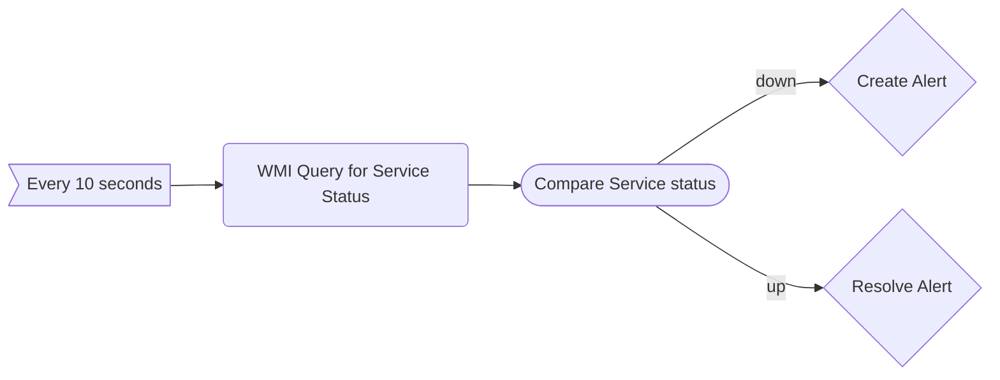
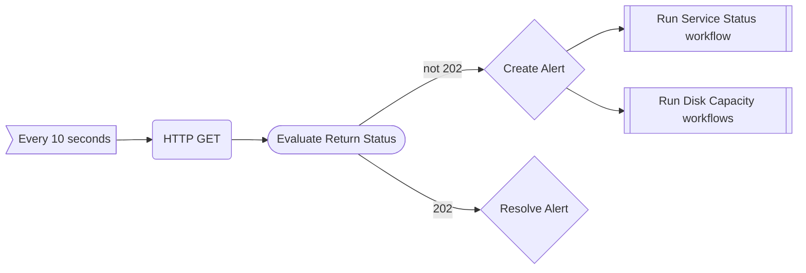

# 🕵️‍♂️Inspector Monitoring Solution

Your friendly workflow-oriented monitoring solutions for data collection and monitoring.

# 💭Motivation

Long time ago I used to work for a financial company in the IT department.
After a year of constant work on improving our monitoring environment, our boss is replaced and the new one decides that we should rebuild the environment with a different solution.
After months of trial and error, instead of choosing a solution appropriate for the organization, another solution, less fitting was chosen because it was cheaper (and because the new boss was already familiar with it).

That was the day I decided that I will quit and develop my own monitoring solution to prove that the chosen solution is so bad that even an IT person can develop a better solution by himself.

# 📜Concept
The main problem I have with modern, open, monitoring solutions is that they're shallow.
You have some sort of 2D (at best) data collection where you need to patch correlation yourself and hope you covered all bases for detecting a problem.

What I suggest is shifting from creating a monitor per a singular collector into a workflow-driven monitoring based on multiple collectors.

When an app is developed (e.g. website) we can already tell which types of scenarios are considered as causing downtime. When there is downtime, it doesn't really matter if it is because a disk is at 90% capacity or because the service needs a restart, but rather, that this unexpected downtime is affecting the business-side of the organization.

Instead of focusing our attention on metrics and logs to indicate a problem - we should explicitly check whether our app is working properly as if we're a user. After a problem has been identified - it's time to rely on our data collectors to provide a clear image of the underlying infrastructure.

# Terms
##  🧱Monitor Blocks
In order to have a solid monitoring infrastructure we require solid building blocks.
Monitor blocks are the core of operation and can be classified as one of the following:

 1. **Trigger** -  A timer / interval for a workflow.
 2. **Collector** - Data collection unit in charge of 1 data collection operation (i.e. monitor one thing only).
 3. **Condition** - Filtration unit turning a value into a "good" / "bad" indicators
 4. **Action** - Automatic procedures to be performed when receiving bad indications. Can be a script, can be a webhook, etc.

## ⚙️Workflow

A workflow is an aggregation of monitor blocks which defines a routine to uncovers problems. example:

This is a simple example of a service probing.
Worklows can reference other workflows in order to be more modular:

#  🔄Progress Log

 - **Jul 18th, 2021**
   - README was created.
   - Core workflow operation is functioning.
   - Workflows can be saved to a local DB and be fetched.
   - Alerts can be written into log files

# Looking at the future

I'll be honest, as much as I love this project, it might not actualize unless I recruit at least another developer. All the logic is already written and all that there is left is writing code.
If someone, somehow manages to read this and is interested in a non-profit [for now at least(?)] project to hone their coding skill, feel free contacting me.

# Disclaimer
© 2021 Omer Roth ( aka TheSilverHawkx). All Rights Reserved.
